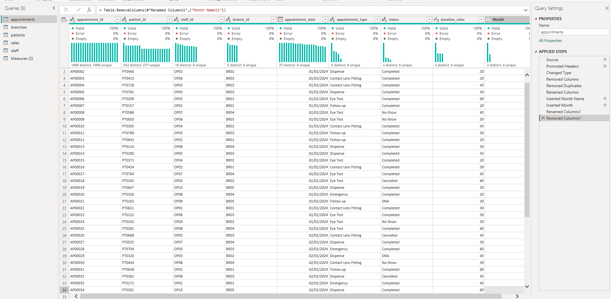
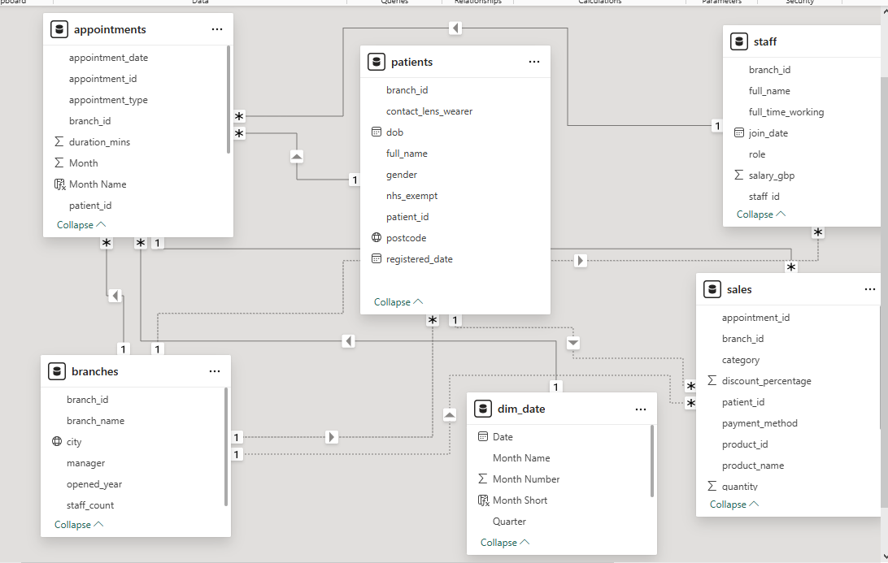
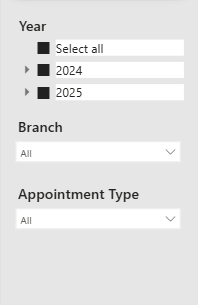
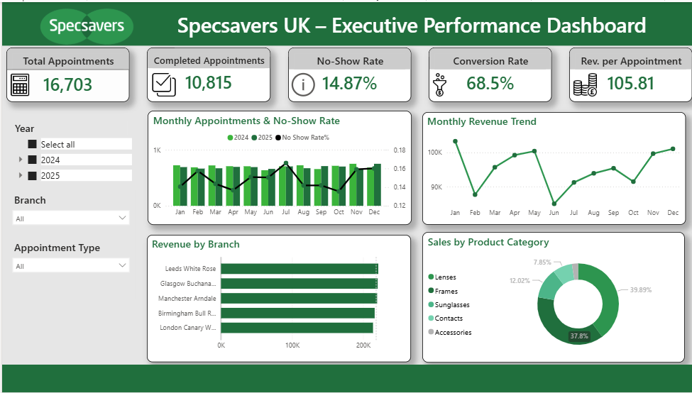

# Specsavers Branch Performance Analysis

**Industry:** Optical Retail / Healthcare Operations  
**Data period:** 2024 to 2025

> **Important:** All data used in this project is fully simulated and does not represent real Specsavers operational figures. Branch names, patient records, staff details, and all revenue numbers are entirely fictional and were created purely for analytical and portfolio purposes. This project does not contain, reference, or expose any real company data.

---
## **Tools & Technologies**

| Category | Tools |
|----------|--------|
| Data Source | Microsoft Excel |
| Data Cleaning & Transformation | Power Query (M Language) |
| Data Modelling | Power BI Data Model (Star Schema) |
| Visualization | Power BI Desktop |
| DAX Calculations | Data Analysis Expressions (DAX) |
| Version Control | Git & GitHub |

---


## 📂 Project Files

| File | Description | Link |
|------|-------------|------|
| Raw Dataset | Simulated Excel data used as the source for this project | [Download Dataset](https://github.com/sanaaziz-analyst/specsavers-performance-powerbi/tree/main/raw_data) |
| Power BI Report | Full `.pbix` file — open in Power BI Desktop to explore | [Download .pbix](https://github.com/sanaaziz-analyst/specsavers-performance-powerbi/blob/main/Specsavers%20Project.pbix) |
| Live Dashboard | Published report viewable in browser (no login required) | [View Dashboard](YOUR_POWERBI_SERVICE_LINK_HERE) |
---
## Why I Built This Project

I spent over a year working as an office manager at Specsavers, so I know firsthand how the business runs. I saw how appointment no-shows affect the day, how branch targets are tracked, how different locations have completely different vibes in terms of footfall and revenue. When I moved into data analytics, building this project felt like a natural first step because I already understood the business context behind the numbers.

This is not a generic dataset I found online. The data is simulated but modelled on how Specsavers actually operates, using the same table structures, KPIs, and branch dynamics I was familiar with from my time there. That background shaped every decision I made in this project, from what to measure to how to interpret what I found.

The goal was simple: give a management team a clear, honest picture of appointment performance, revenue, no-shows, and branch health across the UK, all in one report they can actually use.

---

## The Data
I designed and created five raw tables to work with:

- **Branches** — branch locations, cities, managers, opening years
- **Staff** — roles, join dates, contract types, salary bands
- **Patients** — demographics, NHS exemption status, registration dates
- **Appointments** — dates, types, statuses, duration, linked patient and staff
- **Sales** — products, categories, discounts, payment methods, linked to appointments

Before anything else, I needed to get this data into a shape I could actually model and trust.

---

## Cleaning the Data in Power Query

The raw files came in as CSV and Excel tables. I loaded everything into Power Query and worked through each table systematically before touching the data model.



The first thing I did was turn on column profiling so I could see errors, blanks, and value distributions straight away. That immediately flagged a few things: some columns had the wrong data type, appointment status had inconsistent labels like "No show", "No-Show" and "no_show" all meaning the same thing, and a few dimension tables had duplicate ID rows that would have broken relationships downstream.

I promoted headers where needed, renamed columns into clean business-friendly names, and set correct data types across everything — dates as Date, IDs as Whole Number or Text consistently across tables, revenue fields as Decimal Number, and percentage fields formatted correctly after loading.

One thing that caught me out early was month name ordering in charts. January was appearing after June alphabetically, so I created a Month Name column using FORMAT() and a separate Month Number column, then sorted Month Name by Month Number to get the correct chronological sequence.

I also went into Model View after loading and changed the Data Category on the City and Postal Code fields from Uncategorised to City and Postal Code so that map visuals would work properly.

By the end of the cleaning phase every table was consistent, typed correctly, and ready to connect.

---

## Building the Data Model

I built the report on a star schema. Two fact tables sit at the centre capturing transactional events, and three dimension tables describe the who, where, and what behind those events.



**Fact tables**

- fact_appointments holds one row per appointment and contains date, type, duration, status, and the foreign keys linking to patients, staff, and branches
- fact_sales holds one row per sales transaction, linked back to the appointment that generated it and to the branch

**Dimension tables**

- dim_branches describes each branch including city, manager, and opening year
- dim_patients holds patient demographics and NHS exemption status
- dim_staff covers role, contract type, join date, and salary band

All relationships follow a one-to-many pattern from dimension to fact. I kept cross-filter direction as Single throughout, which is best practice in a star schema because it keeps DAX behaviour predictable and avoids ambiguous filter paths.

I also created a dedicated Measures table to store all DAX calculations separately from the raw data. This keeps the model clean and is standard practice in professional BI teams. Every measure lives in one place, which makes maintenance and debugging much easier.

---
## DAX Measures

**Appointment measures**

```dax
Total Appointments = COUNTROWS(appointments)

Complete Appointments = CALCULATE(COUNTROWS(appointments),appointments[status] = "Complete")

No Show Appointments = CALCULATE(COUNTROWS(appointments),appointments[status] = "No Show")

No Show Rate = DIVIDE([No Show Appointments],[Total Appointments])
```

**Revenue measures**

```dax
Total Revenue = SUM(sales[total_gbp])

Total Discount = SUMX(sales,sales[total_gbp] * sales[discount_percentage])

Revenue After Discount = [Total Revenue] - [Total Discount]

Average Discount % = AVERAGE(sales[discount_percentage])
```

**Time Intelligence measures**

```dax
Revenue PY = CALCULATE([Total Revenue],SAMEPERIODLASTYEAR(dim_date[Date]))

Revenue YoY % =DIVIDE([Total Revenue] - [Revenue PY],[Revenue PY])

Appointments PY = CALCULATE([Total Appointments],SAMEPERIODLASTYEAR(dim_date[Date]))

Appointments YoY % = DIVIDE([Total Appointments] - [Appointments PY],[Appointments PY])
```

**KPI Target measures**

```dax
No Show Rate Target = 0.10

Conversion Rate Target = 0.65

Rev per Appointment Target = 100
```

**Efficiency measures**

```dax
Conversion Rate = DIVIDE([Complete Appointments],[Total Appointments])

Revenue per Appointment = DIVIDE([Total Revenue],[Completed Appointments])
```

**Patient and staff measures**

```dax
Total Patients = DISTINCTCOUNT(patients[patient_id])

New Patients = CALCULATE([Total Patients],YEAR(patients[registered_date]) = YEAR(TODAY()))

Total Staff = DISTINCTCOUNT(staff[staff_id])

Appointments per Staff = DIVIDE([Total Appointments],[Total Staff])
```


---

## The Dashboard

The report has three slicers running across all pages: Year, Branch, and Appointment Type. Everything filters together so a manager can isolate a specific branch or time period instantly.



### Overview Page




The dashboard shows six KPI cards across two rows. The first row covers volume and attendance: Total Appointments, Completed Appointments, and 
No-Show Rate. The second row covers financial performance: Conversion Rate, 
Revenue YoY %, and Appointments YoY %. Together they give any viewer an 
immediate sense of scale, health, and year-on-year growth before going deeper.

### Monthly Appointments & No-Show Rate

A Line and Clustered Column chart showing Monthly Appointments alongside No-Show Rate on a dual axis. This is the chart I spent the most time on because it tells the most nuanced story — volume and behaviour together in one view.

### Revenue 

A line chart tracks Revenue After Discount month by month, showing the trend over the full period. 

A horizontal bar chart ranks branches by revenue, making it immediately obvious which locations are leading and which are falling behind.

### Product and Category

A donut chart breaks revenue down by product category. Lenses, frames, sunglasses, contacts, and accessories each get their own slice, and the proportions tell a clear story about where the business is concentrated and where there might be room to grow.

---
## Business Questions Answered

This project was built to answer six key operational questions 
a Specsavers area manager or regional director would actually ask:

1. **Which branches are underperforming relative to their market potential?**
   → Analysed revenue per branch against location type to identify 
   gaps between expected and actual performance.

2. **When are no-shows highest and why?**
   → Mapped no-show rates by month to identify seasonal patterns 
   and peak-period overbooking risks.

3. **What is the revenue impact of our current no-show rate?**
   → Quantified the £ value of lost appointments against the 
   industry benchmark to size the problem.

4. **Are we growing year on year?**
   → Built YoY measures for both revenue and appointments to track 
   directional performance across 2024 and 2025.

5. **Which product categories are underleveraged?**
   → Broke revenue down by category to identify where contact lenses 
   and accessories are being left on the table.

6. **How efficiently are staff converting appointments into revenue?**
   → Calculated revenue per appointment and appointments per staff 
   member to surface productivity insights.

---

## What I Found

**Appointments are growing but not evenly across the year**

Total appointments across the two-year period reached 16,703. The 
busiest months were January through March, which makes sense when you 
think about it. January is when people act on the resolutions they made 
over Christmas, and NHS vouchers often reset at the start of the year. 
Volume softened noticeably mid-year before picking back up. Looking year 
on year, 2025 started stronger than 2024, which suggests either improving 
patient recall or better marketing performance at branch level.

---

**The no-show rate is a real problem**

14.87% of appointments resulted in a no-show. The optical retail benchmark 
sits somewhere between 8% and 12%, so this is above where it should be. 
What made it more interesting was that no-shows spiked in the same months 
where total appointments were highest. That points to overbooking during 
busy periods rather than a general behavioural issue. Reducing this by even 
two or three percentage points would recover a meaningful amount of revenue 
without needing a single extra patient.

**Quantifying the no-show revenue impact**

With 16,703 total appointments and an average revenue per appointment 
of £105.81, each percentage point of no-show rate represents 
approximately £17,670 in lost revenue annually.

The current no-show rate of 14.87% sits 4.87 percentage points above 
the industry benchmark of 10%. Closing that gap alone would recover 
an estimated **£86,050 in lost revenue per year** — without acquiring 
a single new patient.

> **Calculation:** 16,703 appointments × 4.87% gap = 813 missed 
> appointments × £105.81 avg revenue = **£86,050**

Simple operational changes such as SMS reminders 24 hours before 
appointments or frictionless online rescheduling could realistically 
achieve this, making it one of the highest ROI improvements available 
to the business.

---

**Conversion is strong but there is a hidden gap**

When patients actually show up, the teams do a good job converting them 
into sales. A 64.7% conversion rate is solid. But the gap between 16,703 
total appointments and 10,815 completed ones is significant. That is nearly 
6,000 appointment slots where revenue was zero before the consultation even 
started. Some of those will be genuine cancellations, but some will be 
fixable with better confirmation messages, easier rescheduling, or a simple 
phone call.

---

**Revenue per appointment is drifting downward**

The average across the period was £105.81, but when you look at the monthly 
trend it is a gradual decline from January through to June. This does not 
look like a footfall problem. It looks more like a product mix shift, perhaps 
patients choosing more basic frames or fewer premium lens options. That kind 
of subtle drift is easy to miss unless you are actively tracking it at this 
level of detail.

---

**Some branches are carrying the weight**

Two northern branches were the standout performers. Their revenue was 
consistently higher than the group average and their no-show rates were 
more controlled. At the other end, one of the central London branches 
surprised me. Given the location, the footfall potential, and the premium 
demographic in that area, its revenue numbers were lower than I expected. 
Whether that is down to local competition, appointment mix, or something 
in the patient journey is worth investigating further.

---

**Contacts and accessories are being left on the table**

Lenses accounted for 39.89% of revenue and frames for 37.8%, which is 
exactly what you would expect from an optical retailer. But contacts came 
in at only 7.85% and accessories at 2.44%. Those two categories feel 
underleveraged. Contact lens subscriptions in particular represent a 
recurring revenue stream that most branches seem to be underutilising 
compared to their size.

---

## Reflections

When I first opened this dataset, the headline numbers were fine but not what held my attention. What I kept coming back to was the pattern underneath them. Appointments did not move in a straight line. They rose and fell with a rhythm that only made sense once I connected it to real context: NHS voucher windows, post-Christmas optician visits, the summer slowdown that every retail and healthcare business feels.

The no-show rate was the finding that stuck with me longest. 14.87% sounds like a statistic. But it is also a real person who booked an appointment, then did not show up, and a real member of staff who sat waiting for them. Those empty slots add up fast. The fix is probably not complicated or expensive. A text the day before, a link that makes it easy to reschedule rather than just not turn up. These are small operational changes with measurable revenue impact, and that is exactly the kind of thing a business should be able to see from its data.

One of the central London branches was the branch story I found most interesting. Everything on paper points to it being a strong performer: central London, high footfall, premium catchment area. But the numbers told a different story. That gap between what a location should produce and what it actually produces is exactly the kind of thing analysis is supposed to surface. Whether the cause is operational, competitive, or something in the local patient mix, it deserves attention.

---
## Acknowledgements

All data in this project is fully synthetic and was created by me from scratch to reflect realistic Specsavers optical retail operations. The table structures, KPIs, branch dynamics, and business scenarios are modelled on my direct experience working as an Office Manager at Specsavers, where I gained firsthand knowledge of how appointments, revenue, no-shows, and branch performance are tracked and managed day to day.
All data cleaning, modelling, DAX calculations, and visualisations are entirely my own work.


---

## Contact

**Sana Aziz**

Data Analyst | SQL • Excel • Power BI • Tableau • Python

London, UK

[](mailto:sana.aziz.leo@gmail.com)
[](https://www.linkedin.com/in/sana-aziz-analyst-uk/)
